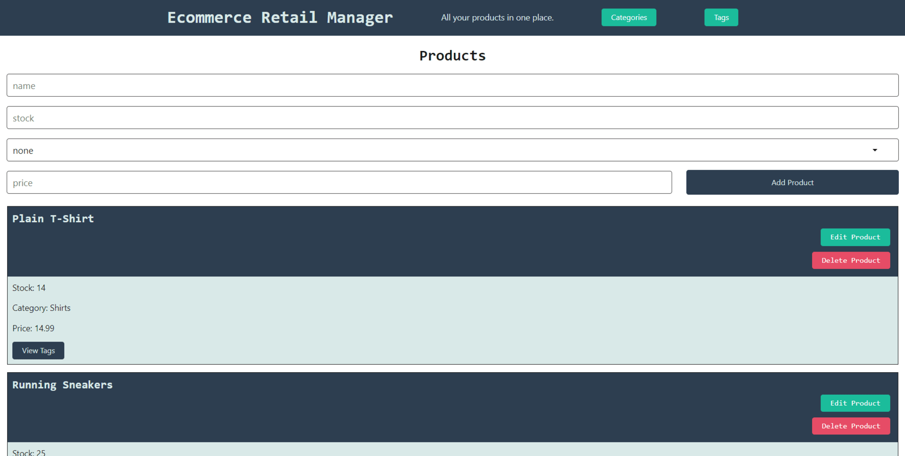
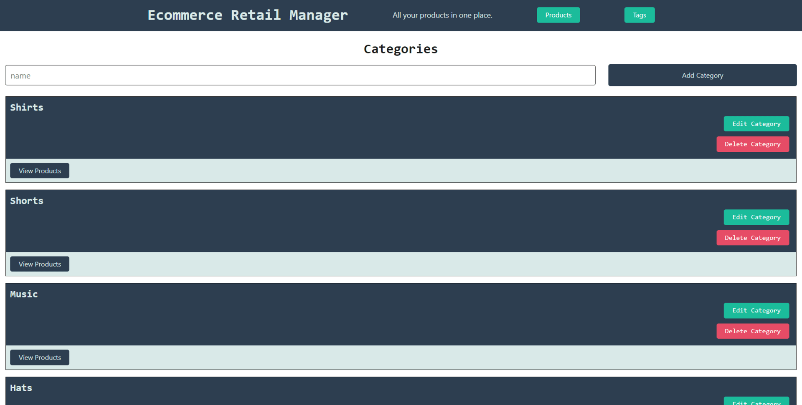
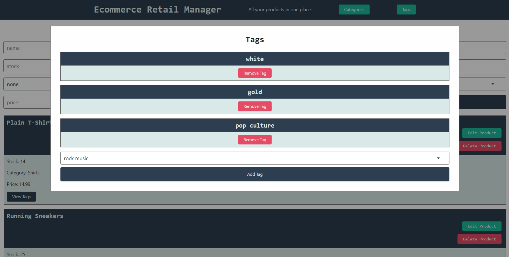

# Full-Stack-Product-Manager

This application is hosted at the following base URL: https://product-manager-45zg.onrender.com/

## Description

This project is a full stack application that uses Sequelize and PostgreSQL along with express.js for the back end. For the front end of the applicaiton, it uses just HTML, JS, and CSS.

## Back End Specifications

1. This API uses the following models:

* `Category`

  * `id`

    * Integer.
  
    * Doesn't allow null values.
  
    * Set as primary key.
  
    * Uses auto increment.

  * `category_name`
  
    * String.
  
    * Doesn't allow null values.

* `Product`

  * `id`
  
    * Integer.
  
    * Doesn't allow null values.
  
    * Set as primary key.
  
    * Uses auto increment.

  * `product_name`
  
    * String.
  
    * Doesn't allow null values.

  * `price`
  
    * Decimal.
  
    * Doesn't allow null values.
  
    * Validates that the value is a decimal.

  * `stock`
  
    * Integer.
  
    * Doesn't allow null values.
  
    * Set a default value of `10`.
  
    * Validates that the value is numeric.

  * `category_id`
  
    * Integer.
  
    * References the `Category` model's `id`.

* `Tag`

  * `id`
  
    * Integer.
  
    * Doesn't allow null values.
  
    * Set as primary key.
  
    * Uses auto increment.

  * `tag_name`
  
    * String.

* `ProductTag`

  * `id`

    * Integer.

    * Doesn't allow null values.

    * Set as primary key.

    * Uses auto increment.

  * `product_id`

    * Integer.

    * References the `Product` model's `id`.

  * `tag_id`

    * Integer.

    * References the `Tag` model's `id`.

2. This project has the following associations:

* `Product` belongs to `Category`, and `Category` has many `Product` models, as a category can have multiple products but a product can only belong to one category.

* `Product` belongs to many `Tag` models, and `Tag` belongs to many `Product` models. Allow products to have multiple tags and tags to have many products by using the `ProductTag` through model.

3. The API contains the following routes using Sequelize for interactions with a database:

    * products:

      * `GET /api/products`

      * `GET /api/products/:id`

      * `POST /api/products`

      * `PUT /api/products/:id`

      * `DELETE /api/products/:id`

    * categories:

      * `GET /api/categories`

      * `GET /api/categories/:id`

      * `POST /api/categories`

      * `PUT /api/categories/:id`

      * `DELETE /api/categories/:id`

    * tags:

      * `GET /api/tags`

      * `GET /api/tags/:id`

      * `POST /api/tags`

      * `PUT /api/tags/:id`

      * `DELETE /api/tags/:id`

The following animation shows the application's GET routes to return all categories, all products, and all tags being tested in Insomnia:

The following animation shows the application's GET routes to return a single category, a single product, and a single tag being tested in Insomnia:

The following animation shows the application's POST, PUT, and DELETE routes for categories being tested in Insomnia:

## Front End Application

The front end application has three different pages, with a modal that pops up for detailed views on each page. Each page also has a form to add an item to the database and an edit form that appears to make edits to a specific item.

The following image shows the application's product page:

The following image shows the application's category page:

The following image shows the application's tag page:

The following image shows the application's product modal:

